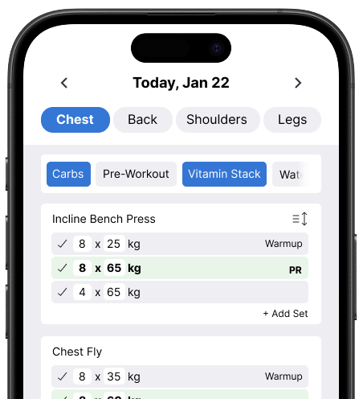

# Welcome! I'm Marko. 👋

I'm currently creating **[BYOworkout](https://byoworkout.com)**, a completely free and highly customizable app for tracking your strength progress.  

---

**Progressive overload at no cost. All the features without a subscription.**

I built BYOworkout to streamline going to the gym and gathering data effectively without wasting time scrolling or tapping. Create workout templates, monitor your strength gains with detailed logging, and visualize your progress with beautiful charts. 

**Built with:** 
      

[**Check it out!**](https://byoworkout.com)

---
