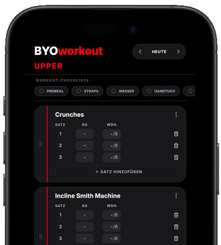
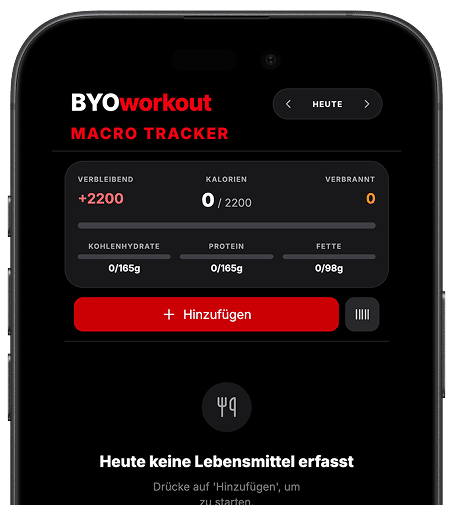
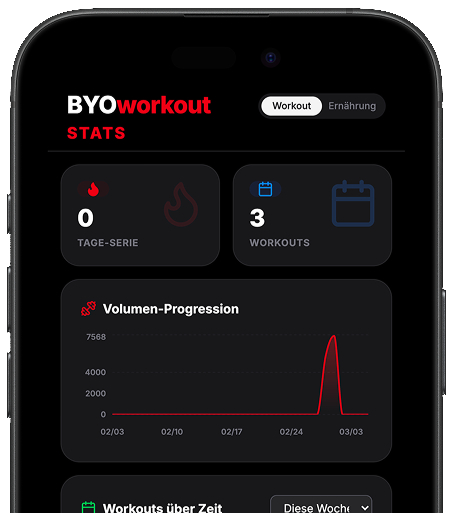

# Hi, I'm Marko. 👋
Software Developer @ Sellmore
 

My daily work:
* Developing custom CRM modules and integrating systems via REST APIs.
* Setting up software on customer servers and handling complex migrations.
* Creating advanced SQL reports to drive business decisions.
* Providing 3rd level technical support

   
 

Check out what I'm working on below!
 
 
---

  <a href="https://byoworkout.com">
    <picture>
      <source media="(prefers-color-scheme: dark)" srcset="./BYOworkout_dark.svg">
      <source media="(prefers-color-scheme: light)" srcset="./BYOworkout_light.svg">
      
    </picture>
  </a>
  
<strong>Progressive overload at no cost. All the features without a subscription.</strong>

  

     
     
     
     
     
     
    
  

   
  Most fitness apps don't account for unique training splits or the need for deep customization. With thousands of apps using predatory monetization and cluttered UI, I decided to build a solution for my own daily life. As a numbers nerd, my priority is making all user data fully exportable and creating a platform versatile enough to fit any training style. 
   

### Workouts

&mdash; Design any training style with unlimited exercises. 
&mdash; Automatic calculations for strength gains and PRs. 
&mdash; PWA support lets you track workouts without internet. 

---

### Nutrition

&mdash; Integrated food search and macro tracking. 
&mdash; Fast entry via barcode scanning. 
&mdash; User data backed across all devices instantly.  

---

### Statistics

&mdash; Detailed graphs and trends based on your history. 
&mdash; Download everything in CSV/JSON format. You own it. 
&mdash; No hidden costs, no subs, and no predatory monetization. 
 

---

